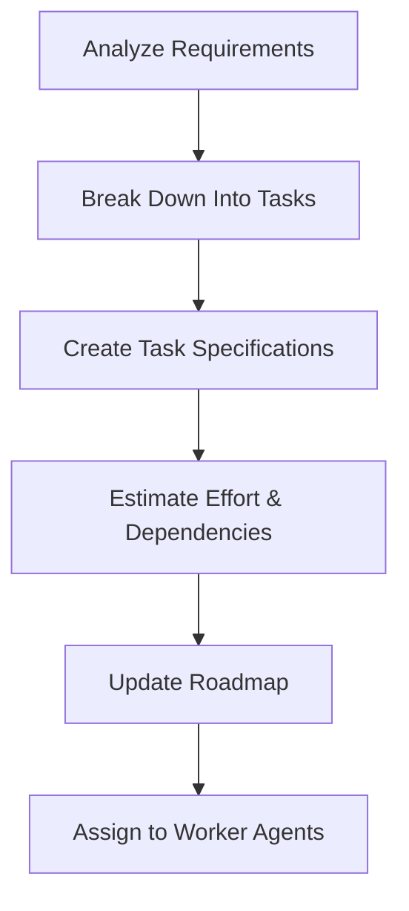
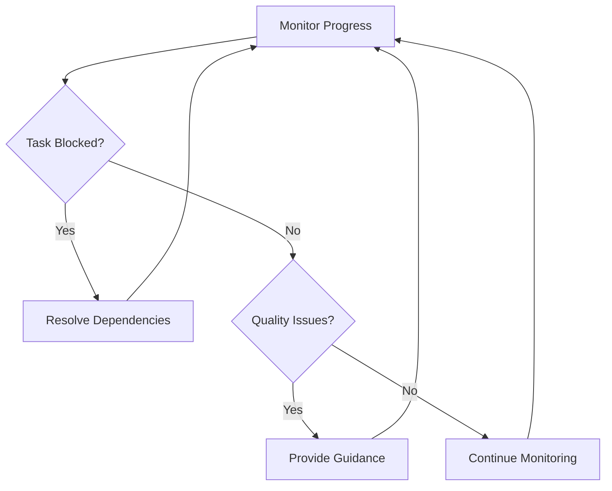
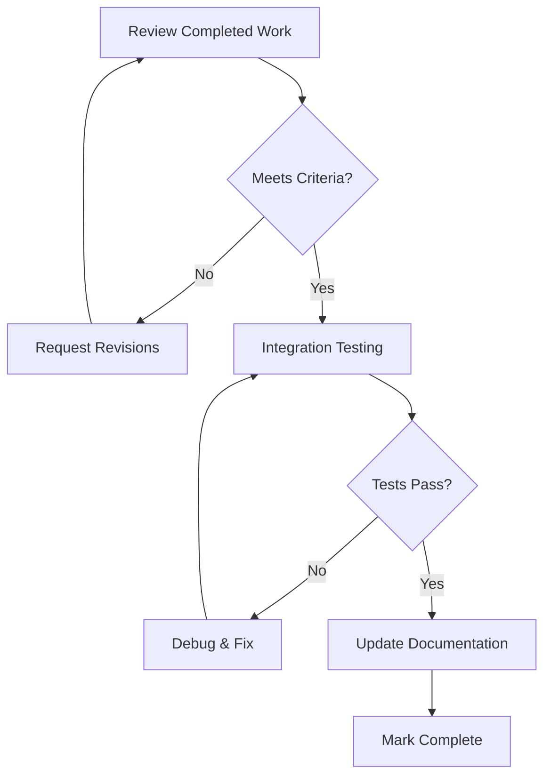

# Agent Orchestrator System

## 🎯 Orchestrator-Worker Architecture

### Core Concept
A primary **Orchestrator Agent** coordinates multiple specialized **Worker Agents** through a task management system with clear task definition, assignment, progress tracking, and completion verification.

## 🏗️ System Components

### 1. Orchestrator Agent (Primary)
**Role**: Task planning, coordination, and quality assurance
**Responsibilities**:
- Analyze project goals and break them into actionable tasks
- Create detailed task specifications with acceptance criteria
- Assign tasks to appropriate worker agents
- Monitor progress and resolve conflicts
- Perform integration and quality checks
- Update roadmap and documentation

### 2. Worker Agents (Specialized)
**Roles**: Execute specific domain tasks with high expertise
**Types**:
- **VMA Specialist**: Memory management improvements
- **Vulkan Graphics Specialist**: Rendering and compute shaders
- **Architecture Specialist**: System design and refactoring
- **Testing & QA Specialist**: Testing, CI/CD, and quality assurance

### 3. Task Management System
**Components**:
- Task board with status tracking
- Task specification templates
- Progress monitoring
- Conflict resolution system
- Integration checkpoints

## 📋 Task Management Framework

### Task States
```
PLANNED -> ASSIGNED -> IN_PROGRESS -> REVIEW -> COMPLETED -> INTEGRATED
```

### Task Priority Levels
- **P0**: Critical blocker (immediate action required)
- **P1**: High priority (current sprint)
- **P2**: Medium priority (next sprint)
- **P3**: Low priority (backlog)

### Task Categories
- **FEATURE**: New functionality implementation
- **IMPROVEMENT**: Enhancement of existing features
- **BUGFIX**: Bug resolution
- **REFACTOR**: Code quality improvements
- **DOCS**: Documentation updates
- **SETUP**: Environment and tooling

## 🎯 Task Specification Template

```yaml
# Task ID: T-YYYY-MM-DD-XXX
Task:
  id: "T-2024-12-07-001"
  title: "Implement Modern VMA Memory Usage Patterns"
  category: IMPROVEMENT
  priority: P1
  assigned_agent: VMA_SPECIALIST
  estimated_effort: "3 hours"
  
Description:
  summary: "Replace deprecated VMA usage patterns with modern VMA 3.3.0 patterns"
  background: "Current code uses deprecated VMA_MEMORY_USAGE_* flags"
  
Requirements:
  functional:
    - Replace VMA_MEMORY_USAGE_GPU_ONLY with VMA_MEMORY_USAGE_AUTO
    - Implement VMA_MEMORY_USAGE_AUTO_PREFER_DEVICE for high-performance buffers
    - Add proper allocation flags for host access patterns
  
  technical:
    - Maintain backward compatibility
    - Add error handling for failed allocations
    - Include performance metrics
    
  quality:
    - Code must pass all existing tests
    - Add unit tests for new patterns
    - Update documentation
    
Acceptance_Criteria:
  - [ ] All VMA allocations use modern usage patterns
  - [ ] Performance is maintained or improved
  - [ ] Memory usage is reduced by at least 10%
  - [ ] All tests pass
  - [ ] Documentation is updated

Dependencies:
  - VMA 3.3.0 submodule integration (T-2024-12-06-005)
  
Files_To_Modify:
  - src/VulkanMemoryManager.cpp
  - include/VulkanMemoryManager.h
  - tests/memory_manager_tests.cpp
  
Validation:
  commands:
    - "./scripts/build/build_minimal.ps1"
    - "./scripts/test/run_memory_tests.ps1"
    - "./scripts/quality/check_memory_usage.ps1"
    
Notes:
  - Coordinate with Graphics Specialist for shader buffer requirements
  - Consider memory budget implications
```

## 🔄 Orchestrator Workflow

### 1. Planning Phase


### 2. Execution Phase


### 3. Integration Phase


## 📊 Task Board System

### Current Task Board (JSON Format)
```json
{
  "project": "3DGameOfLife-Vulkan-Edition",
  "last_updated": "2024-12-07T10:00:00Z",
  "tasks": {
    "T-2024-12-07-001": {
      "title": "Implement Modern VMA Memory Usage Patterns",
      "status": "ASSIGNED",
      "agent": "VMA_SPECIALIST",
      "priority": "P1",
      "category": "IMPROVEMENT",
      "estimated_hours": 3,
      "dependencies": [],
      "created": "2024-12-07T09:00:00Z",
      "assigned": "2024-12-07T10:00:00Z",
      "due_date": "2024-12-07T18:00:00Z"
    },
    "T-2024-12-07-002": {
      "title": "Add VMA Budget Management System",
      "status": "PLANNED",
      "agent": "UNASSIGNED",
      "priority": "P1",
      "category": "FEATURE",
      "estimated_hours": 8,
      "dependencies": ["T-2024-12-07-001"],
      "created": "2024-12-07T09:15:00Z"
    },
    "T-2024-12-07-003": {
      "title": "Implement Smart Buffer Factory",
      "status": "PLANNED",
      "agent": "UNASSIGNED",
      "priority": "P2",
      "category": "IMPROVEMENT",
      "estimated_hours": 12,
      "dependencies": ["T-2024-12-07-001"],
      "created": "2024-12-07T09:30:00Z"
    }
  },
  "agents": {
    "VMA_SPECIALIST": {
      "status": "ACTIVE",
      "current_task": "T-2024-12-07-001",
      "specializations": ["memory_management", "vulkan_memory", "performance"],
      "workload": "MEDIUM"
    },
    "GRAPHICS_SPECIALIST": {
      "status": "AVAILABLE",
      "current_task": null,
      "specializations": ["vulkan_graphics", "shaders", "rendering"],
      "workload": "LOW"
    },
    "ARCHITECTURE_SPECIALIST": {
      "status": "AVAILABLE",
      "current_task": null,
      "specializations": ["system_design", "architecture", "refactoring"],
      "workload": "LOW"
    },
    "QA_SPECIALIST": {
      "status": "AVAILABLE",
      "current_task": null,
      "specializations": ["testing", "ci_cd", "quality_assurance"],
      "workload": "LOW"
    }
  }
}
```

## 🎭 Agent Role Definitions

### Orchestrator Agent Persona
```
You are the ORCHESTRATOR AGENT for the 3DGameOfLife-Vulkan-Edition project.

CORE RESPONSIBILITIES:
1. Project planning and task breakdown
2. Worker agent coordination and assignment
3. Quality assurance and integration
4. Progress monitoring and issue resolution
5. Documentation and roadmap maintenance

DECISION FRAMEWORK:
- Prioritize based on project goals and dependencies
- Consider agent expertise and current workload
- Ensure quality through acceptance criteria
- Maintain project momentum and avoid bottlenecks

COMMUNICATION STYLE:
- Clear, directive, and well-structured
- Provide specific requirements and expectations
- Regular progress check-ins
- Constructive feedback and guidance

TOOLS AVAILABLE:
- Task board management
- Progress tracking
- Quality validation
- Integration testing
- Documentation generation
```

### Worker Agent Enhancement Template
```
You are a WORKER AGENT specialized in [DOMAIN].

ENHANCED RESPONSIBILITIES:
1. Execute assigned tasks with high expertise
2. Report progress and blockers to Orchestrator
3. Collaborate with other agents when needed
4. Ensure quality and test coverage
5. Update relevant documentation

TASK EXECUTION PROTOCOL:
1. Acknowledge task assignment
2. Review requirements and acceptance criteria
3. Ask clarifying questions if needed
4. Implement solution following best practices
5. Test thoroughly and validate quality
6. Report completion with evidence
7. Update documentation as required

COMMUNICATION WITH ORCHESTRATOR:
- Regular progress updates
- Immediate notification of blockers
- Clear requests for guidance or resources
- Detailed completion reports

QUALITY STANDARDS:
- Follow project coding standards
- Include comprehensive testing
- Document public APIs
- Consider performance implications
- Ensure backward compatibility
```

## 🔧 Implementation Tools

### 1. Task Board Manager
```python
class TaskBoardManager:
    def create_task(self, specification: TaskSpec) -> TaskID
    def assign_task(self, task_id: TaskID, agent: AgentID) -> bool
    def update_status(self, task_id: TaskID, status: TaskStatus) -> bool
    def get_agent_workload(self, agent: AgentID) -> WorkloadInfo
    def find_next_task(self, agent: AgentID) -> Optional[TaskID]
    def resolve_dependencies(self, task_id: TaskID) -> List[TaskID]
```

### 2. Progress Monitor
```python
class ProgressMonitor:
    def track_agent_activity(self, agent: AgentID, activity: str)
    def detect_blockers(self) -> List[BlockerInfo]
    def generate_progress_report(self) -> ProgressReport
    def estimate_completion_time(self, task_id: TaskID) -> timedelta
```

### 3. Quality Gate System
```python
class QualityGate:
    def validate_acceptance_criteria(self, task_id: TaskID) -> ValidationResult
    def run_integration_tests(self, task_id: TaskID) -> TestResults
    def check_code_quality(self, changed_files: List[str]) -> QualityReport
    def verify_documentation(self, task_id: TaskID) -> DocumentationStatus
```

## 📈 Success Metrics

### Orchestrator Effectiveness
- **Task Completion Rate**: >90% of tasks completed on schedule
- **Quality Score**: <5% rework required after integration
- **Agent Utilization**: >80% productive time across all agents
- **Dependency Resolution Time**: <2 hours average

### Worker Agent Performance
- **Task Success Rate**: >95% first-time acceptance
- **Code Quality**: 0 critical issues, <3 minor issues per task
- **Documentation**: 100% of public APIs documented
- **Test Coverage**: >90% for new/modified code

### Overall Project Health
- **Velocity**: Consistent task completion rate
- **Technical Debt**: Decreasing over time
- **Bug Rate**: <1 bug per 100 lines of new code
- **Integration Issues**: <10% of tasks require integration fixes

## 🚀 Getting Started

### 1. Initialize System
```bash
# Create task board
./scripts/orchestrator/init_task_board.ps1

# Set up agent profiles
./scripts/orchestrator/setup_agents.ps1

# Create initial task set
./scripts/orchestrator/create_vma_tasks.ps1
```

### 2. Orchestrator Commands
```bash
# Create new task
./scripts/orchestrator/create_task.ps1 -template vma_improvement

# Assign task to agent
./scripts/orchestrator/assign_task.ps1 -task T-2024-12-07-001 -agent VMA_SPECIALIST

# Check progress
./scripts/orchestrator/check_progress.ps1

# Generate status report
./scripts/orchestrator/status_report.ps1
```

### 3. Worker Agent Commands
```bash
# Get assigned tasks
./scripts/worker/get_tasks.ps1 -agent VMA_SPECIALIST

# Update task status
./scripts/worker/update_status.ps1 -task T-2024-12-07-001 -status IN_PROGRESS

# Report completion
./scripts/worker/complete_task.ps1 -task T-2024-12-07-001 -evidence ./test_results/
```

## 🔄 Continuous Improvement

### Weekly Retrospectives
- Review completed tasks and lessons learned
- Identify process improvements
- Update task templates and procedures
- Adjust agent assignments and specializations

### Monthly Reviews
- Analyze productivity metrics
- Update project roadmap
- Refine orchestrator algorithms
- Enhance worker agent capabilities

---

**This orchestrator-worker system transforms chaotic development into coordinated, efficient, and high-quality software delivery.** 