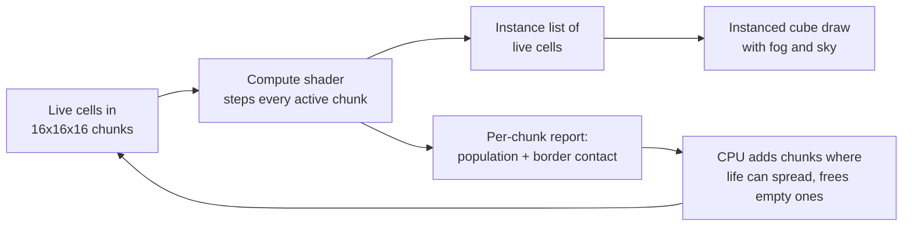

# 3D Game of Life: Vulkan Edition

**Conway's Game of Life, taken into three dimensions and made walkable.** Fly through an unbounded voxel world,
place and break living blocks Minecraft-style, and watch the automaton evolve on the GPU in real time.

[](LICENSE)


*A random 32×32×32 soup under Carter Bays' rule Life 5766. Most of it dies within 30 generations; what's left is
a handful of stable shapes, just as in Conway's 2D game. Every 3D image on this page is a capture from the real game.*

---

## Contents

- [The original: Conway's Game of Life](#the-original-conways-game-of-life)
- [Going 3D: what changes](#going-3d-what-changes)
- [Playing the game](#playing-the-game)
- [Controls](#controls)
- [Download and build](#download-and-build)
- [How it works](#how-it-works)
- [Contributing](#contributing)
- [Further reading](#further-reading)

---

## The original: Conway's Game of Life

In 1970 the mathematician John Horton Conway designed a "zero-player game" that Martin Gardner then published in
his *Scientific American* column. It runs on an infinite grid of square cells. Each cell is either **alive** or
**dead**, and each cell has **8 neighbors**: the cells touching it along an edge or a corner.

Every tick (a *generation*), every cell looks at its neighbors and applies three rules at the same time:

| Situation | Neighbors alive | Next generation |
| -- | -- | -- |
| **Birth**: a dead cell | exactly 3 | comes alive |
| **Survival**: a live cell | 2 or 3 | stays alive |
| **Death**: a live cell | fewer than 2 (loneliness) or more than 3 (overcrowding) | dies |

In the usual notation that rule is **B3/S23**: born with 3, survives with 2 or 3.


Nothing about those rules mentions motion, reproduction or computation, yet all three appear.

### Still lifes, oscillators and spaceships

Patterns that stop changing are **still lifes** (the 2×2 block is the simplest). Patterns that return to their
starting shape after *p* generations are **oscillators** with period *p*:


A pattern that returns to its shape *shifted over* is a **spaceship**. The smallest is the **glider**: five cells
that crawl one cell diagonally every four generations.

| The glider | The Gosper glider gun |
| -- | -- |
|  |  |

Conway guessed that no pattern could grow forever and offered a \$50 prize for a counterexample. Bill Gosper won
it the same year with the **glider gun** above, which fires a new glider every 30 generations. Gliders can carry
signals and guns can make them, and from those parts people have since built logic gates, counters and full
Turing machines inside Life. It is **Turing complete**: anything a computer can compute, a large enough Life
pattern can compute too.

### Why B3/S23 is special

Start from random noise (a "soup") and B3/S23 doesn't die out instantly or boil over. It churns for a long time,
throws off gliders, and slowly settles into a scattered field of still lifes and oscillators:


There are 2¹⁸ = 262,144 rules of this kind ("Life-like" rules: any set of birth counts and any set of
survival counts from 0 to 8). Almost all of them either die out or fill the plane with noise. B3/S23 sits on
the narrow edge between the two, and that balance is what makes it interesting.

---

## Going 3D: what changes

Adding a third dimension sounds like a small change. It isn't.


### 1. The neighborhood more than triples

A cube-shaped cell touches **26** others: 9 in the layer above, 8 around it, and 9 below. Conway's numbers were
tuned for 8. Birth with 3 neighbors meant "3 of 8 nearby cells are alive" (37.5 % local density); in 3D it means
only 3 of 26 (11.5 %). That is far too easy, so **B3/S23 run in 3D explodes**. It grows without limit from
almost any seed. You can see it happen in the bottom-left panel below.

### 2. The rule space becomes astronomically larger

Neighbor counts now run from 0 to 26, so there are 2²⁷ × 2²⁷ = 2⁵⁴
(about 1.8 × 10¹⁶) Life-like rules instead of 262,144. You can't search them by hand, and almost all of
them are boring.

### 3. "Life-like" needs a real definition

In 1987 Carter Bays asked which 3D rules deserve the name *Game of Life*. His criteria were:

1. **Bounded growth**: random soups must not grow forever.
2. **A glider must exist** and must appear naturally from random soups.

He found two rules that pass. Bays writes them as four numbers `E_lo E_hi F_lo F_hi`: a live cell survives with
`E_lo` to `E_hi` neighbors (its *environment*) and a dead cell is born with `F_lo` to `F_hi` (its
*fertility*):

- **Life 5766** (S5-7/B6): survives with 5 to 7 neighbors, born with exactly 6. This is the game's default.
- **Life 4555** (S4-5/B5): survives with 4 or 5, born with exactly 5. Livelier; soups churn longer.

Same seed, same number of generations, four different rules:


### 4. Population over time (seed 7, measured in-game)

| Rule | Gen 0 | Gen 10 | Gen 20 | Gen 40 | Gen 80 | Verdict |
| -- | --: | --: | --: | --: | --: | -- |
| Life 5766 (S5-7/B6) | 9,883 | 3,287 | 640 | 21 | 21 | settles into still lifes and oscillators |
| Life 4555 (S4-5/B5) | 6,634 | 4,454 | 2,697 | 673 | 31 | settles, but more slowly |
| Conway's numbers (S2-3/B3) | 96 | 1,044 | 4,675 | 25,357 | 174,360 | explodes |
| Clouds (S13-26/B13-14,17-19) | 31,889 | 9,823 | 5,956 | 2,164 | 0 | erodes; this soup dies out |
| Crystal (S4/B4) | 96 | 205 | 395 | 1,581 | 18,674 | grows forever |
| Slow Crystal (S4-6/B5) | 516 | 642 | 979 | 2,046 | 6,226 | creeps outward |
| Coral (S5-8/B6-7,9,12) | 149 | 521 | 1,323 | 5,986 | 35,491 | branches out |
| Architecture (S4-6/B3) | 48 | 999 | 4,834 | 30,737 | 224,884 | explodes |

Reproduce any cell of this table with `gol3d --rule N --seed 7 --steps G --frames 1`; the exit line prints the
live-cell count.

### 5. The engineering changes too

- **Memory grows with volume.** A 512-cell-wide 2D board is 262,144 cells; a 512-cell cube is 134 million. This
  game stores only the regions where something is alive, in 16×16×16 chunks.
- **There are no edges.** Many 3D Life programs wrap the world into a torus, so patterns leaving one side come
  back on the other. This one doesn't: the world is unbounded, like a Minecraft map. Chunks are created where
  life can spread next and freed when they empty.
- **You can't see inside a blob.** In 2D every cell is visible. In 3D, the surface hides the interior. Being able
  to walk around, fly through, and break into a pattern is how you look at it.
- **It's a lot of arithmetic.** Each generation visits 26 neighbors per cell, so the simulation runs as a Vulkan
  compute shader on the GPU.

---

## Playing the game

`gol3d` plays like creative-mode Minecraft. You spawn on a flat, infinite floor facing a random soup. Pick a stamp
from the hotbar, place blocks of life, press <kbd>G</kbd>, and watch.


*Three 16³ soups placed from the hotbar, then run under Life 5766.*

**Hotbar stamps** (keys <kbd>1</kbd> to <kbd>8</kbd>):

| Key | Stamp |
| -- | -- |
| <kbd>1</kbd> | Single cell |
| <kbd>2</kbd> | 2×2×2 block |
| <kbd>3</kbd> | 3D plus |
| <kbd>4</kbd> | 8³ random soup |
| <kbd>5</kbd> | 16³ random soup |
| <kbd>6</kbd> | 5×5 wall |
| <kbd>7</kbd> | 8-block pillar |
| <kbd>8</kbd> | The current rule's seed soup |

Press the selected number again to empty your hand. Reach is 6 blocks. What you place lands on the face of the
block you're looking at, or on the ground, or in the air 4 blocks ahead, in that order. A white outline shows
where it will go.

| Stamps and rules (<kbd>Tab</kbd>) | Pause menu (<kbd>Esc</kbd>) |
| -- | -- |
|  |  |

The **Stamps & Rules** screen explains every rule in plain words. **Settings** has field of view, render distance,
mouse sensitivity, GUI scale, simulation speed and HUD options; they're saved between sessions.

---

## Controls

The mapping follows Minecraft's defaults, with one deliberate swap: **left click places, right click removes**.
Simulation actions live on keys Minecraft leaves unbound.

### Moving

| Input | Action |
| -- | -- |
| Mouse | Look around (click the window to grab the mouse) |
| <kbd>W</kbd> <kbd>A</kbd> <kbd>S</kbd> <kbd>D</kbd> | Move |
| <kbd>Space</kbd> | Jump; fly up while flying |
| <kbd>Space</kbd> <kbd>Space</kbd> (double tap) | Toggle flying |
| <kbd>Left Shift</kbd> | Fly down |
| <kbd>Left Ctrl</kbd> | Sprint (doubles flying speed) |

### Building

| Input | Action |
| -- | -- |
| Left click | Place the selected stamp (hold to repeat) |
| Right click | Remove the outlined block (hold to repeat) |
| <kbd>1</kbd>–<kbd>8</kbd>, scroll wheel | Select a hotbar stamp; press the selected number again for an empty hand |
| <kbd>Q</kbd> / <kbd>E</kbd> | Rotate the selected stamp a quarter turn |
| <kbd>Tab</kbd> | Stamps & Rules screen |

### Simulation

| Input | Action |
| -- | -- |
| <kbd>G</kbd> | Run or pause generations |
| <kbd>N</kbd> | Advance one generation (hold to repeat) |
| <kbd>[</kbd> / <kbd>]</kbd> (or <kbd>-</kbd> / <kbd>+</kbd>) | Slower / faster: 0.5 to 60 generations per second |
| <kbd>R</kbd> / <kbd>Shift</kbd>+<kbd>R</kbd> | Next / previous rule (live cells are kept) |

### World and window

| Input | Action |
| -- | -- |
| <kbd>Esc</kbd> | Pause menu (freezes the world) |
| <kbd>Ctrl</kbd>+<kbd>N</kbd> | New world seeded with the rule's soup |
| <kbd>Ctrl</kbd>+<kbd>Shift</kbd>+<kbd>N</kbd> | New empty world |
| <kbd>Ctrl</kbd>+<kbd>S</kbd> / <kbd>Ctrl</kbd>+<kbd>O</kbd> | Save / load `world.life3d` |
| <kbd>F1</kbd> | Hide HUD |
| <kbd>F2</kbd> | Screenshot |
| <kbd>F3</kbd> | Debug overlay (position, chunk, live cells, fps) |
| <kbd>F3</kbd>+<kbd>G</kbd> | Show chunk borders |
| <kbd>F11</kbd> | Fullscreen |
| <kbd>H</kbd> | Print the controls to the terminal |
| <kbd>Ctrl</kbd>+<kbd>Q</kbd> | Quit |

Saves and screenshots go to `~/.local/share/gol3d` on Linux, `%APPDATA%\gol3d` on Windows, and
`~/Library/Application Support/gol3d` on macOS.

---

## Download and build

> **Prebuilt downloads:** the only release on the
> [Releases page](https://github.com/CameronWeller/3DGameOfLife-Vulkan-Edition/releases) is an early alpha that
> predates the playable game. Until a new one is published, build from source. It takes a couple of minutes, and
> CMake fetches GLFW and GLM for you if they aren't installed.

### Requirements

- A GPU and driver with **Vulkan 1.0** support
- **CMake 3.20+**, **Ninja** (or Visual Studio), and a **C++20** compiler
- **`glslc`** to compile shaders (from shaderc or the [Vulkan SDK](https://vulkan.lunarg.com/sdk/home))

#### Linux (Ubuntu / Debian)

```bash
sudo apt install build-essential cmake ninja-build git glslc libvulkan-dev \
  libx11-dev libxrandr-dev libxinerama-dev libxcursor-dev libxi-dev \
  libwayland-dev libxkbcommon-dev wayland-protocols
```

#### Windows

Install Visual Studio 2022 (with "Desktop development with C++"), CMake and the
[LunarG Vulkan SDK](https://vulkan.lunarg.com/sdk/home), which provides `glslc`. Run the commands below from a
"x64 Native Tools" prompt so Ninja finds the compiler.

#### macOS

Install the [Vulkan SDK](https://vulkan.lunarg.com/sdk/home) (it includes MoltenVK and `glslc`), then
`brew install cmake ninja`. macOS runs through MoltenVK and is the least tested platform.

### Clone, build, play

```bash
git clone https://github.com/CameronWeller/3DGameOfLife-Vulkan-Edition.git
cd 3DGameOfLife-Vulkan-Edition
cmake -S prototype -B build/prototype -G Ninja -DCMAKE_BUILD_TYPE=Release
cmake --build build/prototype
./build/prototype/gol3d
```

On Windows the last line is `build\prototype\gol3d.exe`.

### Useful command-line options

```bash
./build/prototype/gol3d --rule 2          # start with Life 4555 (rules are numbered 1-8)
./build/prototype/gol3d --empty --fly     # an empty world, already flying
./build/prototype/gol3d --run --seed 42   # a different soup, simulation already running
./build/prototype/gol3d --chunks 8000     # raise the chunk budget for big, growing rules
./build/prototype/gol3d --help            # everything else
```

### Make an installer or package

```bash
cpack --config build/prototype/CPackConfig.cmake -G "DEB;RPM;TGZ"   # Linux
cpack --config build/prototype/CPackConfig.cmake -G "NSIS;ZIP"      # Windows
cpack --config build/prototype/CPackConfig.cmake -G DragNDrop       # macOS
```

For a portable build, configure with `-DGOL3D_BUNDLE_DEPS=ON` so GLFW and GLM are always built from pinned
sources.

---

## How it works



- **World.** Cells live in 16³ chunks that exist only where life is, or could appear next generation. Space
  outside the chunk set is dead. There is no wraparound.
- **Simulation.** [`shaders/life3d_chunks.comp`](shaders/life3d_chunks.comp) steps every active chunk, reading
  across chunk borders through a table of each chunk's 26 neighbor chunks. The same pass writes the draw list,
  counts each chunk's population, and flags which neighbor chunks the border cells touch.
- **Rules.** A rule is two 27-bit masks: bit *n* of the survive mask is set if a live cell with *n* neighbors
  survives, and likewise for birth. See [`include/Life3DRules.h`](include/Life3DRules.h).
- **Rendering.** Live cells are drawn as instanced cubes with per-face shading and distance fog, over a sky
  gradient and a block grid at y = 0. Hue drifts mostly with height, with a little per-block jitter so flat walls stay readable.
- **Budget.** 2048 chunks by default (`--chunks N`, up to 16000) and about 1M drawn blocks. The first time a world
  hits the limit, the game pauses and tells you.
- **Correctness.** `gol3d --verify` runs soups on the GPU and checks every cell against a plain CPU reference
  implementation.

More detail is in [docs/PROTOTYPE.md](docs/PROTOTYPE.md).

---

## Contributing

Contributions are welcome, from typo fixes to new rules to rendering work.

### Workflow

1. **Open an issue first** for anything bigger than a small fix, so we can agree on the approach.
2. **Fork** the repository and create a branch from `main` (`git checkout -b feature/my-change`).
3. **Build and test** (see below). Add a test when you change simulation logic.
4. **Format** C++ with the repo's [`.clang-format`](.clang-format). Optionally install the hooks with
   `pre-commit install`; they also run markdownlint, shellcheck and black.
5. **Commit** with a short, imperative message. The history uses prefixes like `fix:`, `docs:` and `refactor:`.
6. **Open a pull request** against `main` describing what changed and how you tested it. Screenshots or GIFs help
   for anything visual.

### Running the tests

```bash
ctest --test-dir build/prototype            # CPU rule checks + GPU-vs-CPU check
ctest --test-dir build/prototype -LE gpu    # CPU only (no GPU or display needed)
./build/prototype/gol3d --verify            # the GPU check on its own
```

### Where things live

| Path | What it is |
| -- | -- |
| [`prototype/`](prototype/) | CMake project for the playable game, packaging and tests |
| [`src/main_minimal.cpp`](src/main_minimal.cpp) | The game: Vulkan setup, player, input, UI, chunk manager |
| [`include/Life3DRules.h`](include/Life3DRules.h) | The rule list and the CPU reference simulation |
| [`shaders/life3d_*`](shaders/) | Compute and render shaders |
| [`docs/PROTOTYPE.md`](docs/PROTOTYPE.md) | Detailed game documentation |
| [`scripts/readme-media/`](scripts/readme-media/) | Scripts that regenerate every image and GIF in this README |

### Good first contributions

- **Add a rule.** Append an entry to `lifeRules()` in `include/Life3DRules.h` (and bump the array size). Give it
  a name, survive and birth masks, a seed density and size, and a plain-English description. It then shows up in
  the <kbd>R</kbd> cycle and the Stamps & Rules screen automatically.
- **Add a 3D glider stamp.** Bays' rules have gliders, but there is no stamp for one yet.
- **Pattern files.** Import and export patterns in a documented text format.

### Regenerating the README media

```bash
python3 scripts/readme-media/make_2d_media.py   # 2D Conway GIFs and the neighborhood diagram (Pillow only)
python3 scripts/readme-media/capture_3d.py      # in-game GIFs and screenshots (needs the built game and ffmpeg)
```

Keep each file under 1000 KB (the pre-commit large-file limit).

### Reporting bugs

Open a [GitHub issue](https://github.com/CameronWeller/3DGameOfLife-Vulkan-Edition/issues) with your OS, GPU and
driver version, what you did, what you expected, and what happened. The <kbd>F3</kbd> overlay and the terminal
output are both useful to paste in. See [CONTRIBUTING.md](CONTRIBUTING.md) for more.

---

## Further reading

- Martin Gardner, "The fantastic combinations of John Conway's new solitaire game 'life'", *Scientific American*,
  October 1970.
- Carter Bays, "Candidates for the Game of Life in Three Dimensions", *Complex Systems* 1 (1987), 373–400.
- [LifeWiki](https://conwaylife.com/wiki/), the encyclopedia of Life patterns, including 3D rules.
- [Golly](https://golly.sourceforge.io/), a fast open-source explorer for 2D Life and other cellular automata.

## License

MIT. See [LICENSE](LICENSE).
