# 3D Game of Life: Vulkan Edition

**Conway's Game of Life, taken into three dimensions and made walkable.** Fly through an unbounded voxel world,
place and break living blocks Minecraft-style, and watch the automaton evolve on the GPU in real time, from a
single glider to worlds of hundreds of millions of cells.

[](LICENSE)


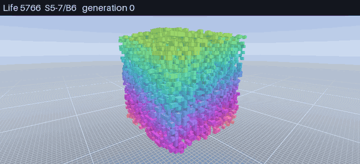

*A random 32×32×32 soup under Carter Bays' rule Life 5766. Most of it dies within 30 generations; what's left is
a handful of stable shapes, just as in Conway's 2D game. Every 3D image on this page is a capture from the real game.*

---

## Contents

- [The original: Conway's Game of Life](#the-original-conways-game-of-life)
- [Going 3D: what changes](#going-3d-what-changes)
- [Playing the game](#playing-the-game)
- [Controls](#controls)
- [Download and build](#download-and-build)
- [How it works](#how-it-works)
- [Performance](#performance)
- [Contributing](#contributing)
- [Further reading](#further-reading)

---

## The original: Conway's Game of Life

In 1970 the mathematician John Horton Conway designed a "zero-player game" that Martin Gardner then published in
his *Scientific American* column. It runs on an infinite grid of square cells. Each cell is either **alive** or
**dead**, and each cell has **8 neighbors**: the cells touching it along an edge or a corner.

Every tick (a *generation*), every cell looks at its neighbors and applies three rules at the same time:

| Situation | Neighbors alive | Next generation |
| -- | -- | -- |
| **Birth**: a dead cell | exactly 3 | comes alive |
| **Survival**: a live cell | 2 or 3 | stays alive |
| **Death**: a live cell | fewer than 2 (loneliness) or more than 3 (overcrowding) | dies |

In the usual notation that rule is **B3/S23**: born with 3, survives with 2 or 3.

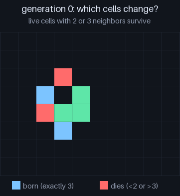

Nothing about those rules mentions motion, reproduction or computation, yet all three appear.

### Still lifes, oscillators and spaceships

Patterns that stop changing are **still lifes** (the 2×2 block is the simplest). Patterns that return to their
starting shape after *p* generations are **oscillators** with period *p*:

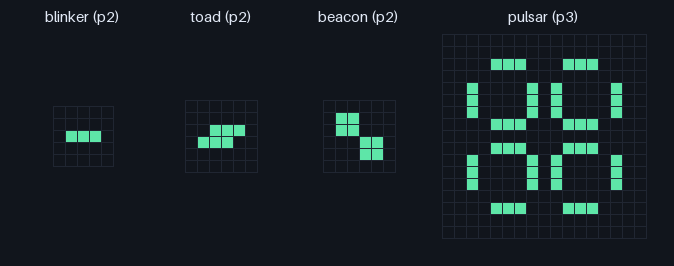

A pattern that returns to its shape *shifted over* is a **spaceship**. The smallest is the **glider**: five cells
that crawl one cell diagonally every four generations.

| The glider | The Gosper glider gun |
| -- | -- |
| 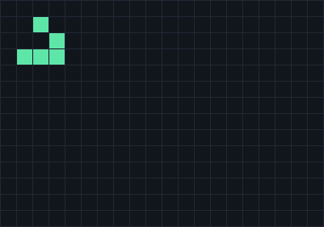 | 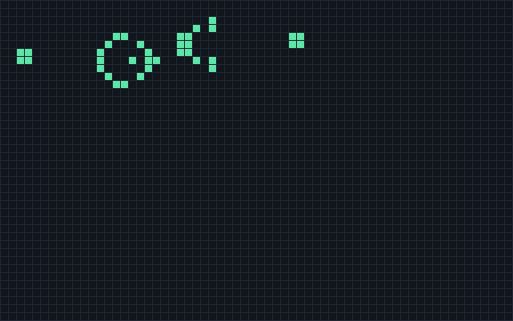 |

Conway guessed that no pattern could grow forever and offered a \$50 prize for a counterexample. Bill Gosper won
it the same year with the **glider gun** above, which fires a new glider every 30 generations. Gliders can carry
signals and guns can make them, and from those parts people have since built logic gates, counters and full
Turing machines inside Life. It is **Turing complete**: anything a computer can compute, a large enough Life
pattern can compute too.

### Why B3/S23 is special

Start from random noise (a "soup") and B3/S23 doesn't die out instantly or boil over. It churns for a long time,
throws off gliders, and slowly settles into a scattered field of still lifes and oscillators:

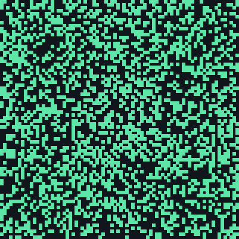

There are 2¹⁸ = 262,144 rules of this kind ("Life-like" rules: any set of birth counts and any set of
survival counts from 0 to 8). Almost all of them either die out or fill the plane with noise. B3/S23 sits on
the narrow edge between the two, and that balance is what makes it interesting.

---

## Going 3D: what changes

Adding a third dimension sounds like a small change. It isn't.

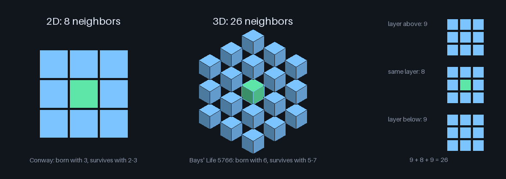

### 1. The neighborhood more than triples

A cube-shaped cell touches **26** others: 9 in the layer above, 8 around it, and 9 below. Conway's numbers were
tuned for 8. Birth with 3 neighbors meant "3 of 8 nearby cells are alive" (37.5 % local density); in 3D it means
only 3 of 26 (11.5 %). That is far too easy, so **B3/S23 run in 3D explodes**. It grows without limit from
almost any seed. You can see it happen in the bottom-left panel below.

### 2. The rule space becomes astronomically larger

Neighbor counts now run from 0 to 26, so there are 2²⁷ × 2²⁷ = 2⁵⁴
(about 1.8 × 10¹⁶) Life-like rules instead of 262,144. You can't search them by hand, and almost all of
them are boring.

### 3. "Life-like" needs a real definition

In 1987 Carter Bays asked which 3D rules deserve the name *Game of Life*. His criteria were:

1. **Bounded growth**: random soups must not grow forever.
2. **A glider must exist** and must appear naturally from random soups.

He found two rules that pass. Bays writes them as four numbers `E_lo E_hi F_lo F_hi`: a live cell survives with
`E_lo` to `E_hi` neighbors (its *environment*) and a dead cell is born with `F_lo` to `F_hi` (its
*fertility*):

- **Life 5766** (S5-7/B6): survives with 5 to 7 neighbors, born with exactly 6. This is the game's default.
- **Life 4555** (S4-5/B5): survives with 4 or 5, born with exactly 5. Livelier; soups churn longer.

#### Conway's game hides inside Life 5766

Take any 2D Life pattern and stack it two layers thick. A live cell with *n* live 2D neighbors now has 2*n* + 1
live 3D neighbors (*n* in each layer, plus its twin), and an empty cell in the slab has 2*n*. Life 5766 keeps a cell
alive when 2*n* + 1 is 5 or 7, so when *n* is 2 or 3, and gives birth when 2*n* = 6, so when *n* is 3. That is
exactly Conway's S23/B3. As long as no cell just above or below the slab sees exactly 6 live neighbors, the slab
runs Conway's game, and Bays' 5766 glider turns out to be Conway's glider, two blocks thick:

| Conway's glider (2D) | Bays' Life 5766 glider (3D, in-game) |
| -- | -- |
|  | 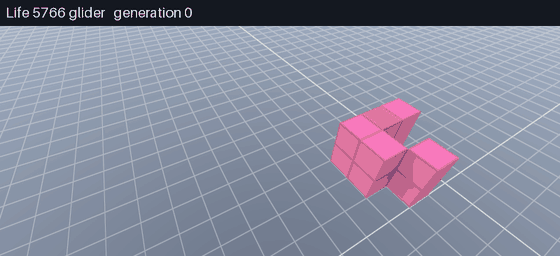 |

Life 4555 has no such copy (its birth count, 5, is odd, and an empty cell in a two-layer slab always has an even
count), so its glider is a different 10-cell shape. The in-game tutorial shows both.

The rules treat every direction alike, so a turned glider travels a turned path. Pick the **Glider** stamp
(<kbd>9</kbd>): on the ground it lies flat and slides diagonally across the floor, and <kbd>Q</kbd>/<kbd>E</kbd>
choose which way. Tilt it with <kbd>Z</kbd> or <kbd>C</kbd> and it stands up, moving sideways while it climbs
(<kbd>Z</kbd>) or dives (<kbd>C</kbd>); life can keep going below the floor. In all, a glider can head in 12
directions, 8 of them partly up or down.

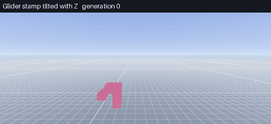

Same seed, same number of generations, four different rules:

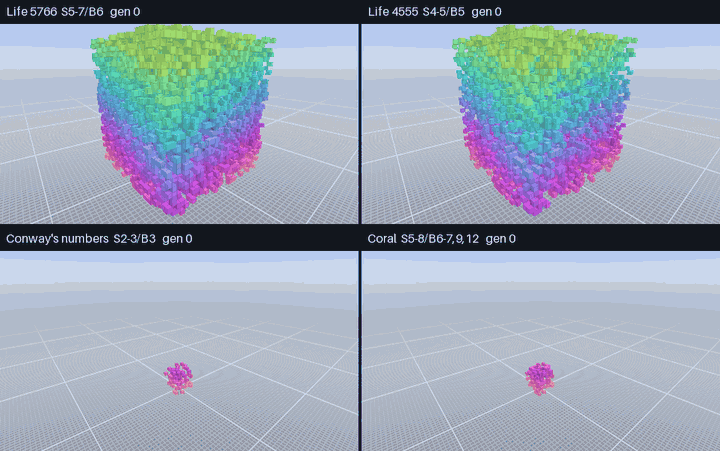

### 4. Population over time (seed 7, measured in-game)

| Rule | Gen 0 | Gen 10 | Gen 20 | Gen 40 | Gen 80 | Verdict |
| -- | --: | --: | --: | --: | --: | -- |
| Life 5766 (S5-7/B6) | 9,883 | 3,287 | 640 | 21 | 21 | settles into still lifes and oscillators |
| Life 4555 (S4-5/B5) | 6,634 | 4,454 | 2,697 | 673 | 31 | settles, but more slowly |
| Conway's numbers (S2-3/B3) | 96 | 1,044 | 4,675 | 25,357 | 174,360 | explodes |
| Clouds (S13-26/B13-14,17-19) | 31,889 | 9,823 | 5,956 | 2,164 | 0 | erodes; this soup dies out |
| Crystal (S4/B4) | 96 | 205 | 395 | 1,581 | 18,674 | grows forever |
| Slow Crystal (S4-6/B5) | 516 | 642 | 979 | 2,046 | 6,226 | creeps outward |
| Coral (S5-8/B6-7,9,12) | 149 | 521 | 1,323 | 5,986 | 35,491 | branches out |
| Architecture (S4-6/B3) | 48 | 999 | 4,834 | 30,737 | 224,884 | explodes |

Reproduce any cell of this table with `gol3d --rule N --seed 7 --steps G --frames 1`; the exit line prints the
live-cell count.

### 5. The engineering changes too

- **Memory grows with volume.** A 512-cell-wide 2D board is 262,144 cells; a 512-cell cube is 134 million. This
  game stores only the regions where something is alive, in 32×32×32 chunks at one bit per cell (4 KB a chunk).
- **There are no edges.** Many 3D Life programs wrap the world into a torus, so patterns leaving one side come
  back on the other. This one doesn't: the world is unbounded, like a Minecraft map. Chunks are created where
  life can spread next and freed when they empty.
- **You can't see inside a blob.** In 2D every cell is visible. In 3D, the surface hides the interior. Being able
  to walk around, fly through, and break into a pattern is how you look at it.
- **It's a lot of arithmetic.** Each generation visits 26 neighbors per cell. The game runs it on the GPU and
  updates 32 cells at once with bitwise adders, so a billion cells take a few milliseconds a generation.

---

## Playing the game

`gol3d` plays like creative-mode Minecraft. You spawn on a flat, infinite floor facing a random soup. Pick a stamp
from the hotbar, place blocks of life, press <kbd>G</kbd>, and watch.

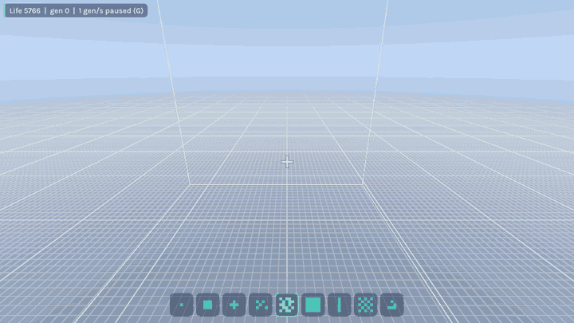

*Three 16³ soups placed from the hotbar, then run under Life 5766.*

**Hotbar stamps** (keys <kbd>1</kbd> to <kbd>9</kbd>):

| Key | Stamp |
| -- | -- |
| <kbd>1</kbd> | Single cell |
| <kbd>2</kbd> | 2×2×2 block |
| <kbd>3</kbd> | 3D plus |
| <kbd>4</kbd> | 8³ random soup |
| <kbd>5</kbd> | 16³ random soup |
| <kbd>6</kbd> | 5×5 wall |
| <kbd>7</kbd> | 8-block pillar |
| <kbd>8</kbd> | The current rule's seed soup |
| <kbd>9</kbd> | Glider: Bays' glider for the current rule (Life 5766 or Life 4555) |

Press the selected number again to empty your hand. Reach is 6 blocks. What you place lands on the face of the
block you're looking at, or on the ground, or in the air 4 blocks ahead, in that order. An outline shows
where it will go. At slow speeds, newborn cells grow in and dying ones shrink away, so you can follow each
generation.

### Materials: Life, Stone and Ember

Stamps are made of the selected **material** (<kbd>M</kbd> cycles, or pick one on the Stamps & Rules screen):

| Material | What it does |
| -- | -- |
| **Life** | Ordinary cells: born, survive and die by the current rule. |
| **Stone** | An inert block. Nothing is born inside it and the rule doesn't count it, so a one-block wall stops a pattern from spreading. Build containers and channels with it. |
| **Ember** | A block that never changes but always counts as a live neighbor. It feeds births next to it, so embers can anchor and power patterns that would otherwise die. |

Placing never overwrites what's already there, and right click removes any block.

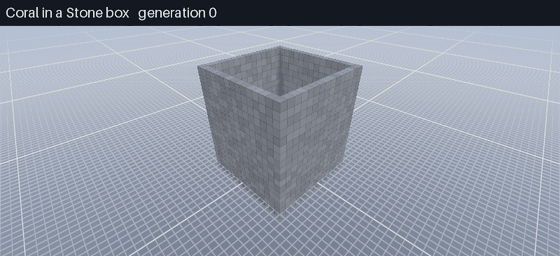

### Speed and long timespans

The speed doubles or halves with each press of <kbd>]</kbd> or <kbd>[</kbd>, from one generation every 32
seconds to 8,192 generations per second, and one more step up is **max**: as fast as your GPU can go. Hold
<kbd>Shift</kbd> to jump 8× at a time. <kbd>J</kbd> fast-forwards 100 generations (<kbd>Shift</kbd>+<kbd>J</kbd>:
1,000) and then returns to the set speed; press <kbd>J</kbd> again to cancel. The pause menu has the same controls
as buttons.

When a world gets too big for the speed you asked for, the game slows the **simulation** down instead of the
frame rate: each frame gets a fixed time budget (Settings > Time per frame), the game measures what a generation
costs and runs only as many as fit. The status panel then shows the speed you set and the speed actually reached,
so the world stays smooth to fly through however big it grows. A small graph under it tracks the population.

### Tutorial

New to 3D Life? Press <kbd>Esc</kbd> and choose **Tutorial**. Eight short lessons each set up a small scene and
explain what to watch for: the 26-cell neighborhood, which cells are born, survive or die, why Conway's numbers
explode in 3D, still lifes, oscillators, both of Bays' gliders, and the rules that aren't Life-like at all. The
world keeps running, so you can step with <kbd>N</kbd>, run with <kbd>G</kbd> and fly around each scene.

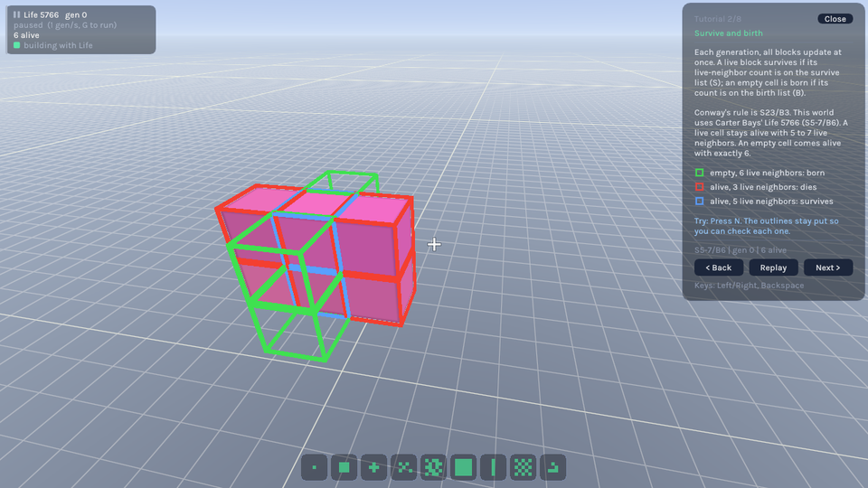

### Menus

| Pause menu (<kbd>Esc</kbd>) | Stamps and rules (<kbd>Tab</kbd>) |
| -- | -- |
| 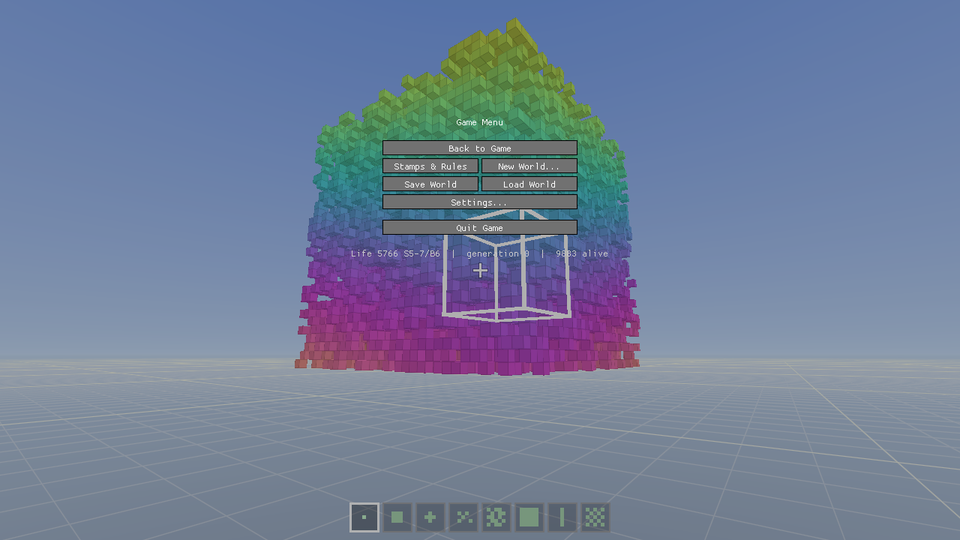 | 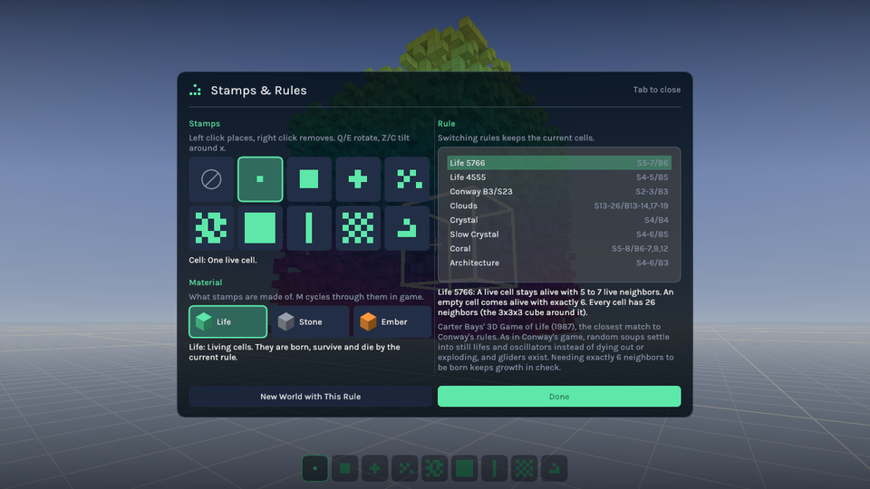 |

The pause menu shows the rule, generation and population, and has the simulation controls. The **Stamps & Rules**
screen picks stamps and materials and explains every rule in plain words. **Settings** has field of view, render
distance (up to 1,024 blocks), smooth lighting, birth and death animations, mouse sensitivity, GUI scale,
simulation speed and time per frame, HUD and update options; they're saved between sessions.

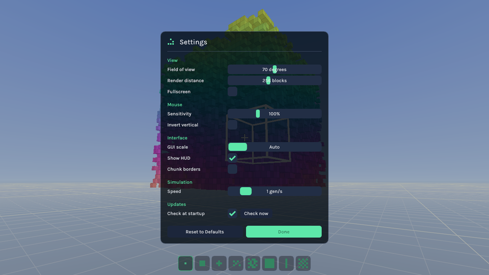

---

## Controls

The mapping follows Minecraft's defaults, with one deliberate swap: **left click places, right click removes**.
Simulation actions live on keys Minecraft leaves unbound.

### Moving

| Input | Action |
| -- | -- |
| Mouse | Look around (click the window to grab the mouse) |
| <kbd>W</kbd> <kbd>A</kbd> <kbd>S</kbd> <kbd>D</kbd> | Move |
| <kbd>Space</kbd> | Jump; fly up while flying |
| <kbd>Space</kbd> <kbd>Space</kbd> (double tap) | Toggle flying |
| <kbd>Left Shift</kbd> | Fly down |
| <kbd>Left Ctrl</kbd> | Sprint (doubles flying speed) |

### Building

| Input | Action |
| -- | -- |
| Left click | Place the selected stamp (hold to repeat) |
| Right click | Remove the outlined block (hold to repeat) |
| <kbd>1</kbd>–<kbd>9</kbd>, scroll wheel | Select a hotbar stamp; press the selected number again for an empty hand |
| <kbd>Q</kbd> / <kbd>E</kbd> | Rotate the selected stamp a quarter turn around the surface |
| <kbd>Z</kbd> / <kbd>C</kbd> | Tilt the selected stamp a quarter turn around the x axis |
| <kbd>M</kbd> / <kbd>Shift</kbd>+<kbd>M</kbd> | Next / previous material: Life, Stone, Ember |
| <kbd>Tab</kbd> | Stamps & Rules screen |

### Simulation

| Input | Action |
| -- | -- |
| <kbd>G</kbd> | Run or pause generations |
| <kbd>N</kbd> | Advance one generation (hold to repeat) |
| <kbd>[</kbd> / <kbd>]</kbd> (or <kbd>-</kbd> / <kbd>+</kbd>) | Half / double speed: 1/32 to 8,192 generations per second, then max; <kbd>Shift</kbd> for 8× |
| <kbd>J</kbd> / <kbd>Shift</kbd>+<kbd>J</kbd> | Fast-forward 100 / 1,000 generations; <kbd>J</kbd> again cancels |
| <kbd>R</kbd> / <kbd>Shift</kbd>+<kbd>R</kbd> | Next / previous rule (live cells are kept) |

### World and window

| Input | Action |
| -- | -- |
| <kbd>Esc</kbd> | Pause menu (freezes the world) |
| <kbd>Ctrl</kbd>+<kbd>N</kbd> | New world seeded with the rule's soup |
| <kbd>Ctrl</kbd>+<kbd>Shift</kbd>+<kbd>N</kbd> | New empty world |
| <kbd>Ctrl</kbd>+<kbd>S</kbd> / <kbd>Ctrl</kbd>+<kbd>O</kbd> | Save / load `world.life3d` |
| <kbd>F1</kbd> | Hide HUD |
| <kbd>F2</kbd> | Screenshot |
| <kbd>F3</kbd> | Debug overlay (position, chunks, GPU memory, blocks drawn, GPU time per generation, fps) |
| <kbd>F3</kbd>+<kbd>G</kbd> | Show chunk borders |
| <kbd>F11</kbd> | Fullscreen |
| <kbd>H</kbd> | Print the controls to the terminal |
| <kbd>Ctrl</kbd>+<kbd>Q</kbd> | Quit |

Saves and screenshots go to `~/.local/share/gol3d` on Linux, `%APPDATA%\gol3d` on Windows, and
`~/Library/Application Support/gol3d` on macOS.

---

## Download and build

### Download a release

Every change to `main` publishes a new build on the
**[latest release page](https://github.com/CameronWeller/3DGameOfLife-Vulkan-Edition/releases/latest)**.
Pick the file for your system:

| System | File | Notes |
| -- | -- | -- |
| Windows 10/11 | `gol3d-<version>-windows-x64.exe` (or `-arm64.exe`) | Installer; a `.zip` too |
| Linux, any distribution | `gol3d-<version>-linux-x86_64.AppImage` (or `-aarch64`) | `chmod +x` it and run |
| Debian / Ubuntu | `gol3d_<version>_amd64.deb` (or `_arm64.deb`) | `sudo apt install ./gol3d_*.deb` |
| Fedora / openSUSE | `gol3d-<version>-1.x86_64.rpm` (or `.aarch64.rpm`) | |
| Arch Linux | `gol3d-<version>-1-x86_64.pkg.tar.zst` | `sudo pacman -U gol3d-*.pkg.tar.zst` |
| macOS 12+ | `gol3d-<version>-macos-universal.dmg` | Not notarized: right-click, **Open** the first time |

`SHA256SUMS` on the same page lists every file's checksum. You need a GPU driver with Vulkan 1.3 support (on macOS,
MoltenVK is bundled).

The game checks GitHub for a newer release when it starts; turn that off in **Settings**. The Windows installer
and the AppImage can update themselves after verifying the download's SHA-256. Other packages open the release
page so your package manager can install the update.

### Build from source

It takes a couple of minutes, and CMake fetches GLFW and GLM for you if they aren't installed.

#### Requirements

- A GPU and driver with **Vulkan 1.3** support (any desktop GPU from the last several years with a current driver)
- **CMake 3.20+**, **Ninja** (or Visual Studio), and a **C++20** compiler
- **`glslc`** to compile shaders (from shaderc or the [Vulkan SDK](https://vulkan.lunarg.com/sdk/home))

##### Linux (Ubuntu / Debian)

```bash
sudo apt install build-essential cmake ninja-build git glslc libvulkan-dev \
  libx11-dev libxrandr-dev libxinerama-dev libxcursor-dev libxi-dev \
  libwayland-dev libxkbcommon-dev wayland-protocols
```

##### Windows

Install Visual Studio 2022 (with "Desktop development with C++"), CMake and the
[LunarG Vulkan SDK](https://vulkan.lunarg.com/sdk/home), which provides `glslc`. Run the commands below from a
"x64 Native Tools" prompt so Ninja finds the compiler.

##### macOS

Install the [Vulkan SDK](https://vulkan.lunarg.com/sdk/home) (it includes MoltenVK and `glslc`), then
`brew install cmake ninja`. macOS runs through MoltenVK and is the least tested platform.

#### Clone, build, play

```bash
git clone https://github.com/CameronWeller/3DGameOfLife-Vulkan-Edition.git
cd 3DGameOfLife-Vulkan-Edition
cmake -S . -B build -G Ninja -DCMAKE_BUILD_TYPE=Release   # or: cmake --preset release
cmake --build build
./build/gol3d
```

On Windows the last line is `build\gol3d.exe`.

#### Useful command-line options

```bash
./build/gol3d --rule 2          # start with Life 4555 (rules are numbered 1-8)
./build/gol3d --empty --fly     # an empty world, already flying
./build/gol3d --run --seed 42   # a different soup, simulation already running
./build/gol3d --speed 64 --run  # start running at 64 generations per second
./build/gol3d --chunks 131072   # let the world grow to 4.3 billion cells (default 32768 chunks)
./build/gol3d --rule 8 --bench 600   # time 600 generations of an exploding rule, then exit
./build/gol3d --help            # everything else
```

#### Make an installer or package

```bash
cpack --config build/CPackConfig.cmake -G "DEB;RPM;TGZ"   # Linux
cpack --config build/CPackConfig.cmake -G "NSIS;ZIP"      # Windows
cpack --config build/CPackConfig.cmake -G DragNDrop       # macOS
```

For a portable build, configure with `-DGOL3D_BUNDLE_DEPS=ON` so GLFW and GLM are always built from pinned
sources.

---

## How it works

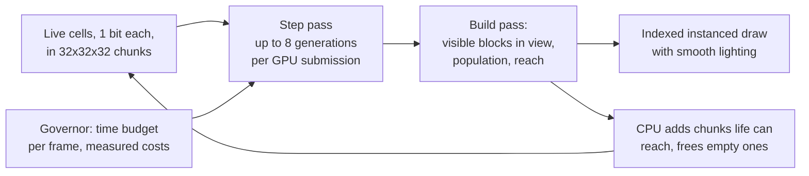

- **World.** Cells live in 32³ chunks that exist only where life is, or could appear within the next few
  generations. A chunk stores one bit per cell: 1,024 rows of 32 cells, 4 KB. Space outside the chunk set is dead,
  and there is no wraparound. The chunk pool starts small and doubles as the world grows, up to `--chunks`.
- **Simulation.** [`shaders/life3d_step.comp`](shaders/life3d_step.comp) computes a whole row of 32 cells per
  GPU thread with bit-sliced arithmetic ([`shaders/life3d_bits.glsl`](shaders/life3d_bits.glsl)): the 26 neighbor
  rows are summed with bitwise full adders into a 5-bit count per cell, and a 32-way multiplexer applies the rule.
  A workgroup first loads its slab of rows and their neighbors into shared memory, reading across chunk borders
  through a table of each chunk's 26 neighbors.
- **Batching.** Life spreads at most one cell per generation. The build pass flags a neighbor chunk whenever live
  cells come within 8 cells of the shared face, so the CPU can create every chunk life could reach and then let the
  GPU run up to 8 generations in one submission without looking.
- **Drawing.** [`shaders/life3d_build.comp`](shaders/life3d_build.comp) lists only blocks with an uncovered face,
  in chunks within the render distance and a slightly widened view, nearest chunks first. Each block carries its
  26 neighbors, so [`shaders/life3d_blocks.vert`](shaders/life3d_blocks.vert) draws only the three faces that can
  face the camera, drops covered ones, and shades corners by the blocks around them (Minecraft-style smooth
  lighting).
- **The governor.** GPU timestamps measure what a generation and a block list cost. Each frame spends at most its
  simulation budget, so when a world outgrows the requested speed the tick rate drops and the frame rate doesn't.
- **Rules.** A rule is two 27-bit masks: bit *n* of the survive mask is set if a live cell with *n* neighbors
  survives, and likewise for birth. See [`src/life/LifeRules.h`](src/life/LifeRules.h).
- **Materials.** The GPU keeps two extra bit planes for chunks with static blocks: "blocked" (no life can exist
  there) and "emits" (counts as a live neighbor). Stone is blocked; Ember is blocked and emits. New kinds of block
  are new combinations or new planes ([`src/life/CellTypes.h`](src/life/CellTypes.h)).
- **Vulkan 1.3.** Dynamic rendering (no render passes), synchronization2 barriers and compute subgroup operations,
  loaded at runtime through [volk](https://github.com/zeux/volk) so one binary runs on any driver.
- **Correctness.** `gol3d --verify` runs soups with Stone and Ember blocks on the GPU, one generation per batch and
  eight, and checks every cell against a plain CPU reference. The `bit_life` test runs the exact shader
  arithmetic on the CPU against the same reference, so CI checks it without a GPU.

### Why not Rust?

The heavy lifting happens in GLSL compute shaders on the GPU, and the CPU's share is small and now cheap: in the
600-generation benchmark below, chunk bookkeeping takes about a tenth of the time. A Rust rewrite of the CPU side
wouldn't make the GPU passes faster, and it would add a second toolchain to every release build (Windows x64 and
ARM64, macOS universal, five Linux formats). The CPU twin of the GPU engine, [`src/life/BitLife.h`](src/life/BitLife.h),
has a small interface; if a CPU engine ever needs to be fast (for example a HashLife-style jump far into the future),
that is the place to start, in either language.

A guided tour of the source, including how the bit-sliced counting works step by step, is in
[docs/ARCHITECTURE.md](docs/ARCHITECTURE.md). More about playing is in [docs/PROTOTYPE.md](docs/PROTOTYPE.md).

---

## Performance

Simulation alone (`gol3d --rule N --seed 7 --bench G`), measured on an Intel Arc Pro B60 with Mesa 26:

| World | Generations | Live cells at the end | Chunks | Time | Generations/s |
| -- | --: | --: | --: | --: | --: |
| Architecture (S4-6/B3), explodes | 200 | 3.4 million | 991 | 0.03 s | 7,700 |
| Architecture | 300 | 11.5 million | 2,756 | 0.06 s | 4,800 |
| Architecture | 600 | 92 million | 18,079 | 0.56 s | 1,075 |
| Architecture, `--chunks 131072` | 1,000 | 429 million | 76,779 | 3.9 s | 260 |
| Crystal (S4/B4), `--chunks 131072` | 1,000 | 189 million | 44,082 | 2.1 s | 470 |
| Life 5766 soup | 10,000 | 21 | 12 | 0.2 s | 47,700 |

The previous engine stored a 32-bit word per cell in 16³ chunks and went back to the CPU after every generation;
it needed about 16 seconds for the first row. Cells now take one bit (32 times less memory), so the
429-million-cell world fits in about 1 GB of GPU memory, all buffers included.

Drawing is capped at 4.2 million visible blocks, nearest first. While you play, the governor keeps frames smooth
by lowering the tick rate. Running the same explosion at 64 generations per second, the game kept that speed at
about 58 frames per second until the world passed 35 million live cells around the player.

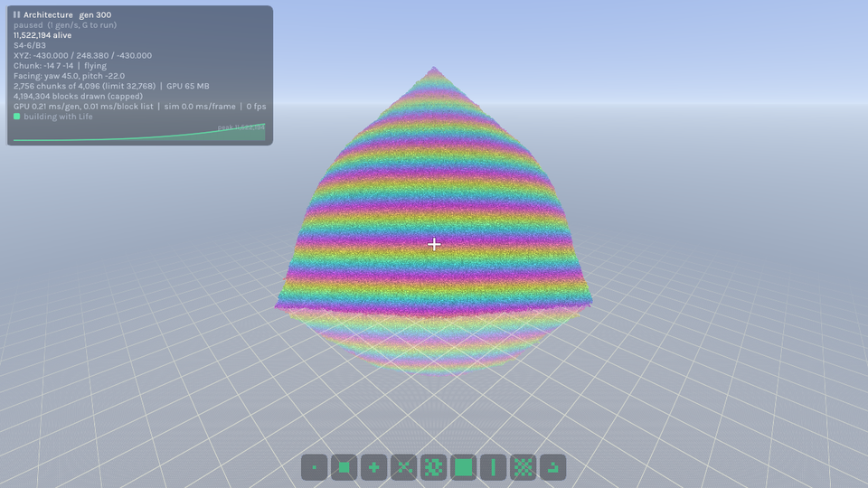

---

## Contributing

Contributions are welcome, from typo fixes to new rules to rendering work.

### Workflow

1. **Open an issue first** for anything bigger than a small fix, so we can agree on the approach.
2. **Fork** the repository and create a branch from `main` (`git checkout -b feature/my-change`).
3. **Build and test** (see below). Add a test when you change logic that runs on the CPU.
4. **Format and lint** C++ with the repo's [`.clang-format`](.clang-format) and [`.clang-tidy`](.clang-tidy),
   following the conventions in [CONTRIBUTING.md](CONTRIBUTING.md). Optionally install the hooks with
   `pre-commit install`; they also run markdownlint, shellcheck and black.
5. **Commit** with a short, imperative message. The history uses prefixes like `fix:`, `docs:` and `refactor:`.
6. **Open a pull request** against `main` describing what changed and how you tested it. Screenshots or GIFs help
   for anything visual.

### Running the tests

```bash
ctest --test-dir build -LE gpu    # CPU only (no GPU or display needed)
ctest --test-dir build            # all of the above plus the GPU-vs-CPU check
./build/gol3d --verify            # the GPU check on its own
GOL3D_VALIDATION=1 ./build/gol3d  # with Vulkan validation layers (if installed)
```

The CPU tests cover the rules and the reference simulation, the bit-sliced engine, the tutorial's pattern
claims, player physics and aiming, stamp shapes, the save format, settings and the command line, the tick
governor's arithmetic, and the updater.

### Where things live

[docs/ARCHITECTURE.md](docs/ARCHITECTURE.md) walks through the code; this is the map.

| Path | What it is |
| -- | -- |
| [`CMakeLists.txt`](CMakeLists.txt) | Build, packaging and tests |
| [`src/game/`](src/game/) | The `Game` and its frame loop, player physics, stamps, settings, command line, tick governor |
| [`src/world/`](src/world/) | The chunked world on the GPU, the compute passes that run it, the save format |
| [`src/life/`](src/life/) | Rules and the CPU reference, materials, known patterns, the CPU twin of the GPU engine |
| [`src/gpu/`](src/gpu/), [`src/render/`](src/render/) | Vulkan helpers; the per-frame renderer |
| [`src/ui/`](src/ui/), [`src/tutorial/`](src/tutorial/) | Menu look and widgets; tutorial lessons and panel |
| [`src/update/`](src/update/) | Release checks, self-update, SHA-256 |
| [`shaders/life3d_*`](shaders/) | Compute and render shaders; [`life3d_bits.glsl`](shaders/life3d_bits.glsl) is shared with the CPU tests |
| [`tests/`](tests/), [`tools/`](tools/) | CPU tests; the glider search |
| [`packaging/`](packaging/), [`release.yml`](.github/workflows/release.yml) | Icons, installers, release pipeline |
| [`docs/`](docs/) | [Architecture](docs/ARCHITECTURE.md) and [game](docs/PROTOTYPE.md) documentation |
| [`scripts/readme-media/`](scripts/readme-media/) | Scripts that regenerate every image and GIF in this README |

### Good first contributions

- **Add a rule.** Append an entry to `lifeRules()` in `src/life/LifeRules.h` (and bump the array size). Give it
  a name, survive and birth masks, a seed density and size, and a plain-English description. It then shows up in
  the <kbd>R</kbd> cycle and the Stamps & Rules screen automatically.
- **Pattern files.** Import and export patterns in a documented text format.

### Regenerating the README media

```bash
python3 scripts/readme-media/make_2d_media.py   # 2D Conway GIFs and the neighborhood diagram (Pillow only)
python3 scripts/readme-media/capture_3d.py      # in-game GIFs and screenshots (needs the built game and ffmpeg)
```

When [gamescope](https://github.com/ValveSoftware/gamescope) is installed, `capture_3d.py` runs the game inside a
headless gamescope session, so no windows open on your desktop. Keep each file under 1000 KB (the pre-commit
large-file limit).

### Reporting bugs

Open a [GitHub issue](https://github.com/CameronWeller/3DGameOfLife-Vulkan-Edition/issues) with your OS, GPU and
driver version, what you did, what you expected, and what happened. The <kbd>F3</kbd> overlay and the terminal
output are both useful to paste in. See [CONTRIBUTING.md](CONTRIBUTING.md) for more.

---

## Further reading

- Martin Gardner, "The fantastic combinations of John Conway's new solitaire game 'life'", *Scientific American*,
  October 1970.
- Carter Bays, "Candidates for the Game of Life in Three Dimensions", *Complex Systems* 1 (1987), 373–400.
- [LifeWiki](https://conwaylife.com/wiki/), the encyclopedia of Life patterns, including 3D rules.
- [Golly](https://golly.sourceforge.io/), a fast open-source explorer for 2D Life and other cellular automata.

## License

MIT. See [LICENSE](LICENSE).
