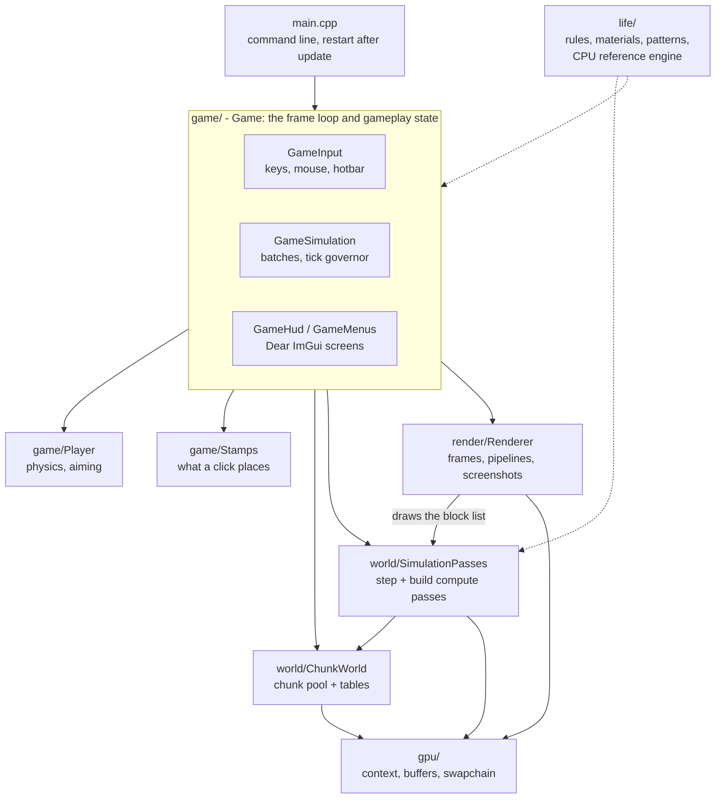

# How the code works

This is a guided tour of the source for people who want to read it, change it,
or borrow ideas from it. It explains how the pieces fit, the few clever parts in
plain words, and where to look for each. The [README](../README.md) covers the
rules and how to play; [CONTRIBUTING.md](../CONTRIBUTING.md) covers conventions.

- [The shape of the program](#the-shape-of-the-program)
- [Where things live](#where-things-live)
- [One frame](#one-frame)
- [The world: chunks of bits](#the-world-chunks-of-bits)
- [Simulating on the GPU](#simulating-on-the-gpu)
- [The tick governor](#the-tick-governor)
- [Drawing](#drawing)
- [The player, stamps and menus](#the-player-stamps-and-menus)
- [How it is tested](#how-it-is-tested)
- [Suggested reading order](#suggested-reading-order)

## The shape of the program

`gol3d` is a single executable. `main()` parses the command line and hands
control to a `Game`, which owns every subsystem and runs the frame loop.

Two ideas shape everything else:

1. **The simulation lives on the GPU.** Cells never travel to the CPU in bulk.
   The CPU only edits a handful of cells when the player clicks, and reads back
   a few numbers per chunk after each batch (how many cells are alive, and which
   neighboring chunks life could spread into).
2. **Everything that does not need a GPU is plain C++ with tests.** Player
   physics, stamp shapes, the save format, settings, the command line, the
   governor's arithmetic and the rules are in the `gol3d_core` library, which
   the CPU tests link without a window or a driver.

## Where things live

| Folder | What is in it |
| -- | -- |
| [`src/main.cpp`](../src/main.cpp) | Entry point: parse options, create the `Game`, restart after an in-place update |
| [`src/game/`](../src/game/) | `Game` (the frame loop, split by concern into `Game*.cpp`), `Player`, `Stamps`, `Settings`, `CommandLine`, `TickGovernor` |
| [`src/world/`](../src/world/) | The chunked world: `ChunkLayout.h` (how cells are packed), `ChunkMap` (coordinate to slot), `ChunkWorld` (the pool), `SimulationPasses` (the compute passes), `SaveFile` |
| [`src/life/`](../src/life/) | What a rule is (`LifeRules.h`), materials (`CellTypes.h`), known patterns (`Patterns.h`), and `BitLife.h`, a CPU copy of the GPU engine for tests |
| [`src/gpu/`](../src/gpu/) | Thin Vulkan helpers: the device (`GpuContext`), buffers, one-shot command submission, barriers, the swapchain |
| [`src/render/`](../src/render/) | `Renderer`: the per-frame draws, pipelines and screenshots |
| [`src/ui/`](../src/ui/) | The menu look (`Theme`) and reusable Dear ImGui widgets (`Widgets`) |
| [`src/tutorial/`](../src/tutorial/) | Lesson content and the lesson panel |
| [`src/update/`](../src/update/) | Release checks, download, SHA-256 verification |
| [`src/platform/`](../src/platform/), [`src/util/`](../src/util/) | Per-OS paths; the PNG writer |
| [`shaders/`](../shaders/) | GLSL: `life3d_step.comp` and `life3d_build.comp` simulate; the rest draw |
| [`tests/`](../tests/) | CPU tests, one program per area (`ctest -LE gpu`) |
| [`tools/`](../tools/) | `FindPatterns.cpp`, the brute-force search that found the gliders |

## One frame

[`Game::mainLoop`](../src/game/Game.cpp) runs once per displayed frame:

1. **Input.** GLFW calls the callbacks in [`GameInput.cpp`](../src/game/GameInput.cpp)
   while polling events. Clicks place or remove cells immediately; they only
   mark the block list as out of date.
2. **Movement.** `Player::update` applies the movement keys, gravity and
   collision ([`Player.cpp`](../src/game/Player.cpp)).
3. **Simulation.** `Game::updateSimulation` works out how many generations are
   owed this frame and runs as many as fit in the time budget, in batches (see
   [the tick governor](#the-tick-governor)).
4. **Block list.** If the world was edited, or the camera moved or turned far
   enough, the build pass rebuilds the list of visible blocks.
5. **UI and draw.** `buildUi()` lays out the HUD or the open menu with Dear
   ImGui; `drawFrame()` fills the per-frame uniforms and outline boxes and hands
   them to the `Renderer`.

## The world: chunks of bits

The world is unbounded, but almost all of it is empty. It is cut into
**chunks** of 32 x 32 x 32 cells, and a chunk exists only where there is life
or a block, or where life could arrive within the next few generations.

**One bit per cell.** A chunk is 1,024 32-bit words. Word `z * 32 + y` holds the
row of 32 cells along x at that (y, z), and bit `x` is the cell at x. A chunk
therefore takes 4 KB, and a billion cells fit in 128 MB. The details are in
[`ChunkLayout.h`](../src/world/ChunkLayout.h).

**A pool of slots.** All chunks live in one big GPU buffer, each in a numbered
*slot*. Next to the cells, small per-slot tables tell the shaders where the
chunk is in the world and which slots hold its 26 neighbors (`NO_CHUNK` where a
neighbor does not exist). The CPU keeps a hash map from chunk coordinate to slot
([`ChunkMap.h`](../src/world/ChunkMap.h), an open-addressing table that stays
fast with hundreds of thousands of chunks).

**Two generations.** There are two cell buffers. A step reads one and writes
the other, then they swap roles. Keeping the previous generation around has a
second use: the build pass compares the two to find births and deaths to
animate.

**Static blocks.** Stone and Ember are not alive, so they do not need the step
pass to update them. Chunks that contain blocks get a slot in a second pool
holding two more bit planes: *blocked* (no life may exist here) and *emits*
(counts as a live neighbor). Stone sets the first, Ember both. See
[`CellTypes.h`](../src/life/CellTypes.h) for how a new material would fit in.

**A chunk's life**, managed by [`ChunkWorld`](../src/world/ChunkWorld.h):

1. `ensureChunk` takes a free slot, zeroes it, and links it to the neighbors that
   exist, in both directions.
2. After every batch, the build pass reports per chunk its population and a
   27-bit *reach mask*: which neighbor directions have live cells within 8 cells
   of the shared face.
3. `maintain()` creates every neighbor in a reach mask, then frees chunks that
   are empty, hold no blocks, and that no live cell can reach.
4. A freed slot is not reused until the next maintenance, because the block
   list on screen may still be drawing its last cells shrinking away.

When the pool runs out of slots it doubles, copying every chunk to the same slot
of the new buffers, until the chunk limit (`--chunks`). The block pool, which
only chunks holding Stone or Ember use, doubles the same way on its own.

## Simulating on the GPU

Each generation runs [`shaders/life3d_step.comp`](../shaders/life3d_step.comp)
over every active chunk. One GPU thread computes one **row** of 32 cells at
once, and a workgroup of 256 threads handles a 32 x 8 slab of rows.

**Getting the neighbors.** A cell's 26 neighbors are in the 9 rows around its
own row (dy and dz from -1 to 1), each looked at three ways: shifted one cell
west, unshifted, and shifted east. Shifting a row left by one bit lines up every
cell with its x - 1 neighbor; the bit that falls off the end comes from the
chunk next door. The workgroup first copies the rows it needs (its slab plus a
one-row border, crossing into neighboring chunks through the neighbor table)
into shared memory, so each row is read from GPU memory once.

**Counting without counting.** The 26 neighbor rows now have to be added up,
per cell. Doing it cell by cell would be 32 separate sums. Instead
[`life3d_bits.glsl`](../shaders/life3d_bits.glsl) adds whole rows with the
logic of a hardware adder, which works on all 32 cells at the same time:

- A *full adder* adds three 1-bit numbers a, b, c into a 2-bit result. Its low
  bit is `a ^ b ^ c` (odd count) and its high bit is "at least two of the three",
  `(a & b) | ((a ^ b) & c)`.
- Applied to 32-bit words, those same two expressions add 32 independent
  columns at once: bit i of the results is the sum of bit i of a, b and c.
- Adding the 26 rows three at a time, then adding the partial sums the same way,
  leaves the neighbor count of every cell as a 5-bit number spread over five
  words: `b0` holds bit 0 of every cell's count, `b1` bit 1, and so on.

This is called *bit slicing*: a 32-bit word is used as 32 one-bit computers.

**Applying the rule.** A rule is two 27-bit masks; bit n of the birth mask is
set if an empty cell with n live neighbors comes alive. For each cell we need
"bit `count` of the mask", and the count is spread over five words. `applyRule`
does this as a tree of 2-to-1 selections, one level per bit of the count:
`(bit & ifOne) | (~bit & ifZero)` picks between two candidates for all 32 cells
at once. Five levels reduce the 32 possible answers to one.

The same file is compiled as C++ by [`BitLife.h`](../src/life/BitLife.h), so the
tests check this arithmetic against a plain cell-by-cell reference without a GPU.

**Batches and reach.** Life spreads at most one cell per generation. After the
last step of a batch, [`life3d_build.comp`](../shaders/life3d_build.comp) flags
each neighbor chunk that has live cells within 8 cells of the shared face. The
CPU creates all of those chunks, so the next batch can safely run 8 generations
(`MAX_BATCH`) in one GPU submission without anything spilling into a chunk that
does not exist.

## The tick governor

The player chooses a speed (2^n generations per second). Big worlds may cost
more per generation than a frame can afford, and the game must never stutter.
The governor ([`Game::updateSimulation`](../src/game/GameSimulation.cpp), with
the arithmetic in [`TickGovernor.h`](../src/game/TickGovernor.h)):

1. adds `speed x frame time` to a debt of generations owed;
2. measures, with GPU timestamps, what one generation and one block-list build
   cost (smoothed over recent batches);
3. runs batches sized to what still fits in the frame's budget (default 8 ms);
4. if it could not pay the debt, forgives it, so the simulation slows down
   instead of the frame rate, and the HUD shows "slowed to keep up" with the
   rate actually reached.

## Drawing

[`Renderer`](../src/render/Renderer.h) draws, in order: the sky, the blocks, the
outline boxes, the ground grid, the HUD (crosshair and hotbar), then Dear
ImGui's menus.

The blocks are never sent from the CPU. The build pass writes a **block list**,
one 8-byte instance per visible block, and fills in an indirect draw command
with the count. A block is visible if any of its six faces is uncovered; the
instance records which of its 26 surrounding cells are occupied (format in
[`BlockInstances.h`](../src/world/BlockInstances.h), with the shader side in
[`life3d_instances.glsl`](../shaders/life3d_instances.glsl)), so
[`life3d_blocks.vert`](../shaders/life3d_blocks.vert) can draw only the three
faces that can face the camera, collapse covered ones, and darken corners by
their neighbors (ambient occlusion, like Minecraft's smooth lighting).

The block list covers only chunks within the render distance and inside a view
somewhat wider than the camera's, nearest chunks first. It is rebuilt when the
world changes, or after the camera moves 16 blocks or turns far enough to
uncover chunks it left out.

## The player, stamps and menus

- [`Player`](../src/game/Player.h) has Minecraft's body (0.6 x 1.8 blocks, eyes
  at 1.62) and speeds. Collision moves one axis at a time and sweeps every cell
  along the way, so a fast step cannot tunnel through a wall. `aim()` walks the
  crosshair ray through the grid cell by cell (Amanatides and Woo's voxel
  traversal) to find the block it hits.
- [`Stamps`](../src/game/Stamps.h) turn a hotbar slot, the targeted face and the
  rotation into a list of cells.
- Menus use [Dear ImGui](https://github.com/ocornut/imgui), an *immediate mode*
  UI library: there are no widget objects, each frame simply calls a function per
  widget, and the function returns true when it was clicked. The screens are in
  [`GameMenus.cpp`](../src/game/GameMenus.cpp); the shared look and building
  blocks are in [`src/ui/`](../src/ui/).

## How it is tested

The GPU engine is checked against the simplest possible implementation:
`stepLifeReference` in [`LifeRules.h`](../src/life/LifeRules.h) counts all 26
neighbors of every cell in a dense box. Three layers build on it:

| Check | What it compares | Needs a GPU |
| -- | -- | -- |
| `ctest -LE gpu` (`tests/`) | The bit-sliced arithmetic (through `BitLife.h`), patterns, tutorial claims, player physics, stamps, saves, settings, command line, governor, updater | No |
| `gol3d --verify` (`ctest -L gpu`) | The real GPU engine, every rule, with Stone and Ember, against the reference, cell by cell | Yes |
| Scripted runs | `--pos`, `--look`, `--place`, `--steps`, `--screenshot` and friends drive the real game; the README media are made this way | Yes |

Scripted runs also make refactors safe: run the same scripts with the old and
new build and compare the screenshots and printed output byte for byte.

## Suggested reading order

1. [`src/life/LifeRules.h`](../src/life/LifeRules.h): what a rule is, and the
   reference simulation.
2. [`src/world/ChunkLayout.h`](../src/world/ChunkLayout.h) and
   [`shaders/life3d_storage.glsl`](../shaders/life3d_storage.glsl): how cells are stored.
3. [`shaders/life3d_bits.glsl`](../shaders/life3d_bits.glsl) and
   [`shaders/life3d_step.comp`](../shaders/life3d_step.comp): one generation.
4. [`src/world/ChunkWorld.h`](../src/world/ChunkWorld.h): how chunks come and go.
5. [`src/game/Game.h`](../src/game/Game.h), then `Game.cpp` and
   `GameSimulation.cpp`: how it all runs each frame.
